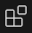
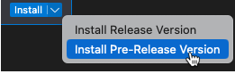
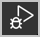
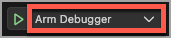

# Arm Debugger

## Overview

The **Arm Debugger** extension provides access to the Arm Debugger engine for Visual Studio Code by implementing the [Microsoft Debug Adapter Protocol (DAP)](https://microsoft.github.io/debug-adapter-protocol//). The Arm Debugger engine supports connections to physical targets, either through external debug probes such as the Arm's ULINK™ family of debug probes, or through on-board low-cost debugging such as CMSIS-DAP based debug probes.

### Supported features

The Arm Debugger extension allows you to:

- Load images (for example, .elf, .axf, or .bin files) and debug information as per the DWARF Debugging Information Format Standard, up to and including version 5
- Run images
- Set breakpoints
- Do source and instruction stepping
- Access variables and registers
- View the content of memory
- Access the [CLI](https://developer.arm.com/documentation/101471/2023-0/Arm-Debugger-commands) using the Debug Console

### Debug configuration support

The Arm Debugger engine supports debug connections based on:

- The [debug setup with CMSIS-Pack](https://open-cmsis-pack.github.io/Open-CMSIS-Pack-Spec/main/html/coresight_setup.html)
- The integrated [configuration database (configdb)](https://developer.arm.com/documentation/101470/2023-0/DTSL/Arm-Development-Studio-configuration-database)

### Supported architectures and processors

- Armv6-M architecture
    - Cortex-M0, Cortex-M0+, Cortex-M1, Arm SecurCore™ SC000
- Armv7-M architecture
    - Cortex-M3, Cortex-M4, Cortex-M7, Arm SecurCore™ SC300
- Armv8-M architecture
    - Cortex-M23, Cortex-M33, Cortex-M35P
- Armv8.1-M architecture
    - Cortex-M55, Cortex-M85

### Supported debug probes

- [Arm ULINK family](https://www.arm.com/products/development-tools/debug-probes/ulink)
- ST-LINK from STMicroelectronics
- Probes based on the [CMSIS-DAP](https://arm-software.github.io/CMSIS_5/latest/DAP/html/index.html) debug adapter protocol v1.x and v2.x

## Arm Debugger extension pre-release

The **Arm Debugger** extension is currently delivered as a pre-release, with a limited subset of debug features exposed in the Visual Studio Code user interface. Additional features are available with the command line. 

For now, we recommend using the **Arm Debugger** extension version that is included in the **Keil Studio Pack** pre-release. The **Keil Studio Pack** provides an easy way to set up your development environment. You can also use the **Arm Debugger** extension as standalone, but this requires additional configuration.

Some capabilities of the Arm Debugger engine that are not yet exposed in Visual Studio Code include:

- CoreSight trace
- Symmetric and asymmetric multicore debug
- RTOS awareness

## Install the extension

We recommend installing the **Arm Debugger** extension that is included in the **Keil Studio Pack** pre-release. Install the pack to get access to the **Arm Debugger** extension.

1. In Visual Studio Code desktop, click the **Extensions** icon  in the Activity Bar to open the **Extensions** view.

1. Search for **Keil Studio Pack**.

1. Click the arrow next to the **Install** button and select **Install Pre-Release Version**.

    

1. Clone one of the [Hello world examples](https://github.com/Arm-Examples#hello-world-examples). 

    Each example contains a `vcpkg-configuration.json` manifest file that describes the tools you need to work with the example project.

1. Go to the **Explorer** view  and open the `vcpkg-configuration.json` manifest file.

1. To install the Arm Debugger engine, add the following line in the `"requires":` section of the manifest file:

    ``` "arm:debuggers/arm/armdbg": "6.0.1" ```

    The **Arm Environment Manager** extension contained in the **Keil Studio Pack** uses the `vcpkg-configuration.json` file to locate and install the required tools for the example project, including the Arm Debugger engine. Once installed, tools are available on the PATH.

    **Note**: You can automatically download new patch versions by using `~` in front of the version. For example: `"~6.0.1"`.

## Use the Arm Debugger extension

You need the **Arm CMSIS csolution** and the **Arm Device Manager** extensions that come with the **Keil Studio Pack** in order to run and debug projects on your board.

### Run the project on your board 

1. Go to the **CMSIS** view .

1. Click the **Build** button  in the **ACTIONS** panel to build the project.

    You can also run the `CMSIS Build` task from the Command Palette (Ctrl+Shift+P on Windows or Cmd+Shift+P on macOS).

1. Connect your board over USB.

    The board is detected and a pop-up message displays in the bottom right-hand corner of the screen.

1. Click **OK** in the pop-up message.

    Alternatively, you can go to the **Device Manager** view , click the **Add Device** button, then select your board in the drop-down list that displays at the top of the window.

1. Check that your board is connected in the **Device Manager** view.

1. Open the Command Palette and search for `Tasks: Configure Task` then select it.

1. Select the `arm-debugger.flash: Flash Device` task.

    This adds the following lines in the `tasks.json` file that is stored in the `.vscode` folder of the project.

    ```
    {
		"type": "arm-debugger.flash",
		"serialNumber": "${command:device-manager.getSerialNumber}",
		"program": "${command:arm-debugger.getApplicationFile}",
		"cmsisPack": "${command:device-manager.getDevicePack}",
		"problemMatcher": [],
		"label": "arm-debugger.flash: Flash Device"
	}
    ```

1. Click the **Run** button  in the **ACTIONS** panel to deploy the application binary to the board, then select the correct device name and CPU if prompted to do so.

    You can also do the same from the Command Palette:

    1. Open the Command Palette and search for `Tasks: Run Task` then select it.

    1. Select `arm-debugger.flash: Flash Device` in the drop-down list.

1. For boards with multiple cores, you must select the appropriate processor for your project in the [Select a processor]{.ui} drop-down list that displays at the top of the window.

### Debug the project on your board

1. To debug a project, create an `Arm Debugger` configuration in the `launch.json` file that is stored in the `.vscode` folder of the project. Add the following lines inside `"configurations":[`:

    ```
    {
		"name": "Arm Debugger",
		"type": "arm-debugger",
        "request": "launch",
		"serialNumber": "${command:device-manager.getSerialNumber}",
		"program": "${command:embedded-debug.getApplicationFile}",
		"cmsisPack": "${command:device-manager.getDevicePack}"
	}
    ```

1. To start a debug session, go to the **RUN AND DEBUG** view  and select the `Arm Debugger` configuration in the list , then click the **Start Debugging** button.

1. For boards with multiple cores, you must select the appropriate processor for your project in the [Select a processor]{.ui} drop-down list that displays at the top of the window.

## Configure Arm Debugger

Visual Studio Code uses launch configuration files to provide settings to the debugger.

Example of a `launch.json` file:

```
{
        "configurations": [
        {
            "name": "Arm Debugger",
            "type": "arm-debugger",
            "request": "launch",
            "serialNumber": "${command:device-manager.getSerialNumber}",
            "program": "${command:embedded-debug.getApplicationFile}",
            "cmsisPack": "${command:device-manager.getDevicePack}",
            "connectMode": "auto",
            "debugFrom": "main",
            "probe": "CMSIS-DAP",
            "programMode": "auto",
            "resetMode": "auto"
        }    
    ]
}
```

## Submit feedback

To submit feedback on the Arm Debugger extension pre-release version, please [open a bug report or a feature request](https://github.com/Arm-Software/vscode-arm-debugger/issues/new/choose).
