# Arm-Debugger extension Interfaces and Dependencies

## Dependency Diagram

```mermaid
flowchart TB

    subgraph User Machine
        subgraph vs Code
            direction LR
            arm-debugger["`
                **Arm Debugger extension**
                ❬❭ arm-debugger
                🡂 getApplicationFile
                🡂 flash
                🡂 debug
                🡂 showDebugConfigPreview
                🡂 showRunConfigPreview
                🡂 showDebugConfigSource
                🡂 showRunConfigSource
                🡂 registers.changeValue
                🡂 functions.setBreakpoint
                🡂 functions.sort
                🡂 createTemplate
                🡂 undoCommand
                🡂 redoCommand
                🖉 debug-config
                🖉 run-config
            `"]:::arm-debugger-pack
            environment-manager["`
                **Environment Manager extension**
                🢂 installPackage
            `"]:::arm-debugger-pack
            virtual-hardware["`
                **Virtual hardware extension**
                🡂 createFvpParamsFile
                🢂 listAvailableVhts
                🢂 onDidChangeDevices
                🖉 fvpParamsEditor
            `"]
            device-manager["`
                **Device manager extension**
                🡂 getDeviceName
                🢂 getDevices
            `"]
            cmsis-solution["`
                **Cmsis solution extension**
                🡂 getTargetPack
                🡂 getDeviceName
                🡂 getProcessorName
            `"]
            keil-studio["`
                **Keil Studio pack**
            `"]
            development-studio[Development Studio pack]
            peripheral-inspector["`
                **Peripheral Inspector extension**
            `"]:::arm-debugger-pack
            memory-inspector["`
                **Memory Inspector extension**
                ❬❭ arm-debugger
            `"]:::arm-debugger-pack

            environment-manager --Armdbg installation--> arm-debugger
            virtual-hardware --FVP binary detection<br>FVP parameter editor--> arm-debugger
            device-manager -.USB device detection<br>Device name to CMSIS name mapping.-> arm-debugger
            cmsis-solution -.Target and application parameters.-> arm-debugger
            keil-studio -.MDK6 default configuration.-> arm-debugger
            development-studio:::unreleased -..-> arm-debugger
            arm-debugger -..->peripheral-inspector
            arm-debugger -..->memory-inspector
        end
        subgraph File System
            direction LR
            armdbg["`
                **Arm Debugger**
                🢂 MS DAP
            `"]
            vcpkg-file["
                **vcpkg file**
            "]
            armdbg==Debugging functionality==>arm-debugger
            vcpkg-file--armdbg version-->armdbg
        end
    end

    subgraph Legend
        command[🡂 Command]
        api[🢂 API]
        editor[🖉 Editor]
        debug-type[❬❭ Debug Type]
        arm-debugger-pack[Arm Debugger Pack]:::arm-debugger-pack
    end

    classDef unreleased stroke-dasharray: 5 5;
    classDef arm-debugger-pack fill:#bbf;
```

## Docs

[🡂 Command](https://code.visualstudio.com/api/extension-guides/command): A VS Code command callable by other extensions.

[🢂 API](https://code.visualstudio.com/api/references/vscode-api#Extension): A VS Code API accessible by other extensions.

[❬❭ Debug Type](https://code.visualstudio.com/api/extension-guides/debugger-extension): A debug adapter type that gets registered in VS Code.

[🖉 Editor](https://code.visualstudio.com/api/extension-guides/custom-editors): A custom editor tailored for specific file types, names, etc. that gets registered to VS Code. This can be functionality added to standard text editor behavior or a Webview.